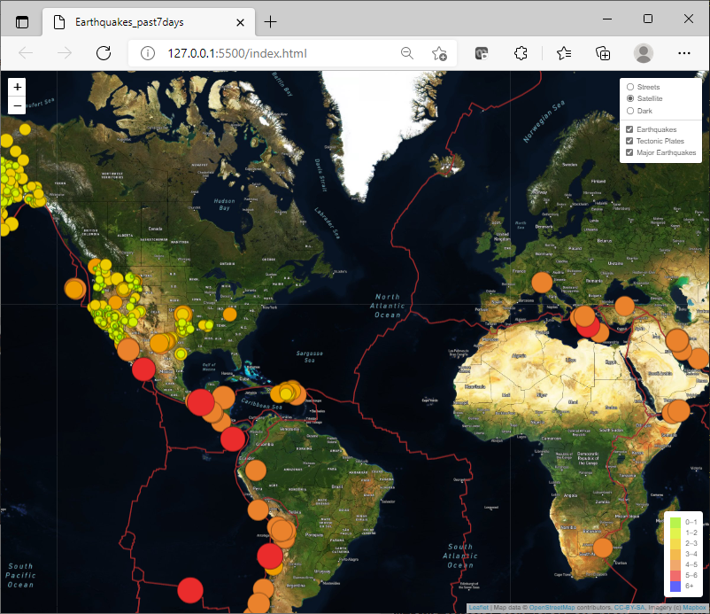

# Mapping_Earthquakes

## Purpose: - 

    To see the earthquake data in relation to the tectonic plates' location on the earth.
    To add major earthquake data with a magnitude greater than 4.5 on the map. 
    To add an additional map style to the earthquake map. 

## Results:- (please refer to the attached files (challenge_logic.js, css and index.html) for the details)

### Deliverable 1:- 
        Using JavaScript, Leaflet.js, d3.Json and geoJSON data, tectonic plate data was added to the earthquake data. 
### Deliverable 2:-  
        Major earthquake data was added to the map by using JavaScript, Leaflet.js, d3.Json and geoJSON data. 
### Deliverable 3:
        Using Mapbox style a third map style as a tile layer was added to the earthquake data. 
